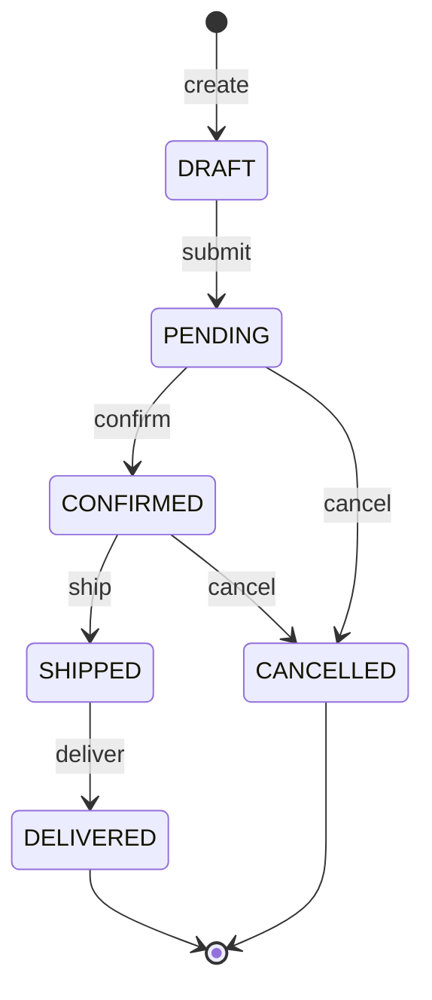
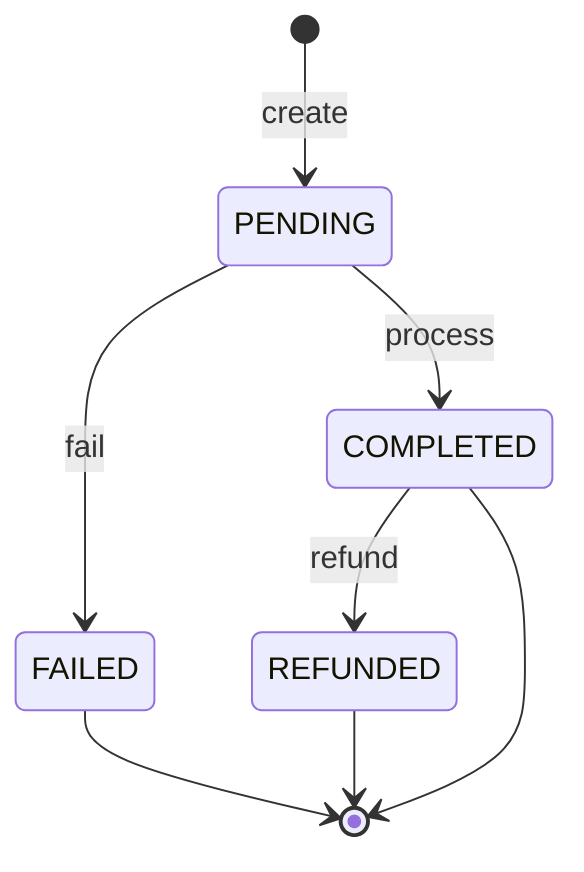

# Proposal: Order Management API (Expanded Scope)

## Intent

Build a realistically-scoped order management REST API to **practice Uncle Bob's Clean Architecture** end-to-end. Six domains — auth, customers, products, orders, payments, inventory — exercise every layer: entities with real business rules, use cases that orchestrate cross-domain logic, adapters that translate HTTP, and a framework layer that wires it all. The user writes ALL code by hand; the orchestrator writes zero code.

## Scope

### In Scope
- **Orders**: Aggregate with state machine (DRAFT→PENDING→CONFIRMED→SHIPPED→DELIVERED + CANCELLED). Create, read, list, add/remove items, all transitions.
- **Auth**: Registration, login, JWT tokens, password hashing, protected routes (users see only their own orders).
- **Payments**: Record payment against order, validate amount matches order total, payment status lifecycle.
- **Inventory**: Products have stock. Order creation validates stock. Confirmation deducts. Cancellation restores.
- **CRUDs**: Full Customer (register, get, update, list) and Product (create, get, update, list, delete).
- **Storage**: In-memory or `.json` file. Repository interfaces designed for one-file-per-entity swap to Postgres/Mongo.
- **Deploy**: Free hosting ($0 — Render free tier or similar). Smoke test against live URL.
- **Testing**: TDD per layer — unit (entities), unit+mocks (use cases), integration (adapters).
- **Architecture**: Pure 4-layer Clean Architecture. Entities encapsulate business rules.
- **Stack**: TypeScript + Express + Zod + Vitest + pnpm.

### Out of Scope
- Frontend / UI
- CI/CD pipelines, Docker
- Real database (designed for swap, not implemented)
- Email, invoices, PDFs, notifications
- Role-based access (single user role)

## Capabilities

### New Capabilities
- `auth`: User registration, login, JWT authentication middleware, password hashing
- `customer-management`: Customer CRUD (register, get, update, list)
- `product-management`: Product CRUD (create, get, update, list, delete) with stock tracking
- `order-management`: Order aggregate, state machine, item management, all transitions
- `payment`: Payment recording, amount validation, payment status lifecycle
- `inventory`: Stock validation on order creation, deduction on confirmation, restoration on cancellation

### Modified Capabilities
None (greenfield project)

## Architecture

```mermaid
---
config:
  theme: default
---
flowchart TB
    accTitle: Clean Architecture 4-layer with all domains
    accDescr: Concentric layers showing where auth, orders, payments, inventory, products, and customers map

    subgraph FW["Layer 4: Frameworks & Drivers"]
        Express["Express server\nroutes, middleware\nJWT auth middleware"]
        InMemDB["In-memory /\nJSON file store"]
    end

    subgraph IA["Layer 3: Interface Adapters"]
        Controllers["Controllers\nauth, customer, product\norder, payment"]
        Presenters["Presenters\n(DTO → HTTP response)"]
        Repos["Repository impls\n(in-memory / JSON)"]
    end

    subgraph UC["Layer 2: Use Cases"]
        AuthUC["Register, Login\nValidateToken"]
        CustomerUC["Create, Get\nUpdate, List"]
        ProductUC["Create, Get\nUpdate, List, Delete"]
        OrderUC["Create, AddItem\nRemoveItem, Submit\nConfirm, Ship\nDeliver, Cancel"]
        PaymentUC["CreatePayment\nGetPayment"]
        InventoryUC["CheckStock\nDeductStock\nRestoreStock"]
        Interfaces["Repository\ninterfaces"]
    end

    subgraph ENT["Layer 1: Entities (innermost)"]
        User["User"]
        Customer["Customer"]
        Product["Product"]
        Order["Order aggregate"]
        OrderItem["OrderItem"]
        Payment["Payment"]
        StatusMachine["Order state machine"]
        PaymentStatus["Payment state machine"]
    end

    FW --> IA --> UC --> ENT
```

**Dependency rule**: `frameworks → interface-adapters → use-cases → entities`. Inner layers never import outer layers.

## Domain Model

| Entity | Role | Key Fields | Business Rules |
|--------|------|------------|----------------|
| **User** | Auth identity | id, email, passwordHash, createdAt | Email unique. Password hashed (bcrypt). |
| **Customer** | Business customer | id, userId, name, email, phone?, createdAt | Linked to User. Name required. |
| **Product** | Catalog item | id, sku, name, price, stock, createdAt | SKU unique. Price > 0. Stock ≥ 0. |
| **Order** | Aggregate root | id, customerId, status, items[], total, createdAt, updatedAt | ≥1 item. Total = Σ(item subtotals). State machine governs transitions. |
| **OrderItem** | Child entity | id, productId, quantity, unitPrice, subtotal | Quantity > 0. Subtotal = quantity × unitPrice. |
| **Payment** | Payment record | id, orderId, amount, status, method, createdAt | Amount must match order total. Linked to one order. |

### Relationships
- User 1:1 Customer (registration creates both)
- Customer 1:N Orders
- Order 1:N OrderItems
- Order 1:1 Payment
- Product referenced by OrderItem (by ID, not embedded)

## State Machines

### Order Status

**Rules**: No other transitions valid. Cancelled orders cannot be modified. Items can only be added/removed in DRAFT.

### Payment Status

**Rules**: Only COMPLETED payments allow order confirmation. REFUNDED triggers order cancellation + stock restoration.

## API Surface

### Auth
| Method | Endpoint | Use Case | Auth |
|--------|----------|----------|------|
| POST | `/auth/register` | RegisterUser | Public |
| POST | `/auth/login` | LoginUser | Public |

### Customers
| Method | Endpoint | Use Case | Auth |
|--------|----------|----------|------|
| GET | `/customers/:id` | GetCustomer | Protected |
| PATCH | `/customers/:id` | UpdateCustomer | Protected |
| GET | `/customers` | ListCustomers | Protected |

### Products
| Method | Endpoint | Use Case | Auth |
|--------|----------|----------|------|
| POST | `/products` | CreateProduct | Protected |
| GET | `/products/:id` | GetProduct | Public |
| PATCH | `/products/:id` | UpdateProduct | Protected |
| GET | `/products` | ListProducts | Public |
| DELETE | `/products/:id` | DeleteProduct | Protected |

### Orders
| Method | Endpoint | Use Case | Auth |
|--------|----------|----------|------|
| POST | `/orders` | CreateOrder | Protected |
| GET | `/orders/:id` | GetOrder | Protected (own) |
| GET | `/orders` | ListOrders | Protected (own) |
| POST | `/orders/:id/items` | AddItemToOrder | Protected (own, DRAFT only) |
| DELETE | `/orders/:id/items/:itemId` | RemoveItemFromOrder | Protected (own, DRAFT only) |
| PATCH | `/orders/:id/submit` | SubmitOrder | Protected (own) |
| PATCH | `/orders/:id/confirm` | ConfirmOrder | Protected |
| PATCH | `/orders/:id/ship` | ShipOrder | Protected |
| PATCH | `/orders/:id/deliver` | DeliverOrder | Protected |
| PATCH | `/orders/:id/cancel` | CancelOrder | Protected (own) |

### Payments
| Method | Endpoint | Use Case | Auth |
|--------|----------|----------|------|
| POST | `/orders/:id/payment` | CreatePayment | Protected |
| GET | `/orders/:id/payment` | GetPayment | Protected |

## Auth Flow

1. **Register**: POST `/auth/register` → hash password (bcrypt) → store User + Customer → return JWT
2. **Login**: POST `/auth/login` → verify password → return JWT (contains userId, email, 24h expiry)
3. **Protected routes**: Express middleware extracts `Bearer <token>` → verify JWT → attach `req.user` → next()
4. **Ownership checks**: Controllers compare `req.user.userId` with resource's customerId. Users see only their own orders.

## Inventory Rules

| Event | Stock Action |
|-------|-------------|
| CreateOrder (add item) | **Validate**: requested quantity ≤ available stock. No deduction yet. |
| SubmitOrder (DRAFT→PENDING) | No stock change. |
| ConfirmOrder (PENDING→CONFIRMED) | **Deduct**: reduce product stock by each item's quantity. |
| CancelOrder (PENDING/CONFIRMED→CANCELLED) | **Restore**: if stock was deducted (was CONFIRMED), add back. If was PENDING, no-op. |
| Payment REFUNDED | **Restore**: add stock back (same as cancel after confirmation). |

## Payment Rules

- Payment amount **must equal** order total. Mismatch → reject.
- Only **one payment per order** (no partial payments).
- Payment must be COMPLETED before order can transition to CONFIRMED.
- FAILED payment does not block order submission but blocks confirmation.
- REFUNDED payment triggers order cancellation + stock restoration.

## Testing Philosophy

| Layer | Type | Tools | Domains Covered |
|-------|------|-------|-----------------|
| **Entities** | Pure unit | Vitest | Order state machine, Payment state machine, invariants (totals, quantities, stock ≥ 0) |
| **Use Cases** | Unit + mocks | Vitest + `vi.fn()` | Auth (hash/verify), Order orchestration, Payment validation, Inventory check/deduct/restore |
| **Adapters** | Integration | Vitest + Supertest | HTTP round-trips: auth flow, CRUD endpoints, order transitions, payment creation |

**TDD flow per domain**: entity tests first (no deps) → use-case tests (mock repos) → integration tests (wire everything). Vertical slices.

## Day-by-Day Breakdown (5-7 Days)

| Day | Build | Tests |
|-----|-------|-------|
| **1** | Project setup (pnpm, TS, Vitest, Express). Entities: User, Customer, Product, Order, OrderItem, Payment. State machines. | Entity unit tests: all invariants, all valid/invalid transitions |
| **2** | Repository interfaces for all domains. In-memory implementations. Auth use cases (Register, Login). Customer + Product CRUD use cases. | Use-case unit tests with mocked repos for auth, customer, product |
| **3** | Order use cases: CreateOrder, AddItem, RemoveItem, GetOrder, ListOrders. Inventory check on creation. | Use-case unit tests for order creation + item management |
| **4** | Order transition use cases (Submit, Confirm, Ship, Deliver, Cancel). Payment use cases. Inventory deduct/restore logic. | Use-case tests for transitions, payment validation, stock deduction/restoration |
| **5** | Express controllers, routes, Zod schemas for ALL endpoints. JWT auth middleware. DI wiring. | Integration tests: auth flow, protected routes, CRUD endpoints |
| **6** | Integration tests: order lifecycle end-to-end (create → add items → submit → pay → confirm → ship → deliver). Cancel + refund flows. | Full lifecycle integration tests |
| **7** | Deploy to Render free tier. Smoke test all endpoints against live URL. Fix issues. | Live smoke test checklist |

## Affected Areas

| Area | Impact | Description |
|------|--------|-------------|
| `src/entities/` | New | User, Customer, Product, Order, OrderItem, Payment + state machines |
| `src/use-cases/` | New | ~20 use cases across 6 domains + repository interfaces + DTOs |
| `src/interface-adapters/` | New | Controllers (auth, customer, product, order, payment), presenters, in-memory repos |
| `src/frameworks/` | New | Express app, routes, JWT middleware, server bootstrap, config |
| `tests/` | New | Unit + integration tests for all 6 domains |

## Risks

| Risk | Likelihood | Mitigation |
|------|------------|------------|
| Scope too large for 7 days | Med | Day-by-day slices are independently demoable. If behind, cut Day 6-7 to "extension" |
| Cross-domain complexity (order+payment+inventory interact) | Med | Use cases orchestrate; entities stay pure. Test each domain in isolation first |
| Anemic domain (logic leaks into use cases) | Med | Entity tests enforce rules live in entities. Code review checkpoint on Day 1 |
| Auth adds boilerplate (middleware, ownership checks) | Low | JWT middleware is ~30 lines. Ownership check is a reusable helper |
| Boilerplate fatigue (many files across 6 domains) | Med | Consistent folder structure per domain. Each file has single responsibility |
| In-memory state lost on restart | Low | Acceptable for learning. JSON file backup as optional fallback |

## Rollback Plan

Greenfield — no existing code to break. If scope proves too large by Day 3:
1. **First cut**: Drop payment domain (orders work without it, confirm without payment gate).
2. **Second cut**: Drop inventory rules (orders skip stock checks).
3. **Third cut**: Drop customer CRUD (use seeded customers).

Each cut preserves a working, testable system.

## Dependencies

- TypeScript 5.x, Express 5, Vitest, Zod, Supertest, jsonwebtoken, bcrypt, pnpm
- No external services (in-memory storage)
- Render free tier for deploy ($0/mo)

## Success Criteria

- [ ] All 4 Clean Architecture layers exist with correct dependency direction
- [ ] Order state machine enforced in entity — invalid transitions throw
- [ ] Payment state machine enforced — amount validation, status transitions
- [ ] Inventory: stock checked on creation, deducted on confirmation, restored on cancellation
- [ ] JWT auth: register, login, protected routes, ownership checks
- [ ] All ~20 use cases implemented with unit tests passing
- [ ] Express API responds correctly to all endpoints (integration tests)
- [ ] Full order lifecycle tested end-to-end: create → items → submit → pay → confirm → ship → deliver
- [ ] Cancel + refund flow tested with stock restoration
- [ ] Repository swap test: in-memory impl replaceable without touching use cases
- [ ] Deployed to free hosting, smoke test passes against live URL
- [ ] User can explain WHY each layer exists and what crosses boundaries
