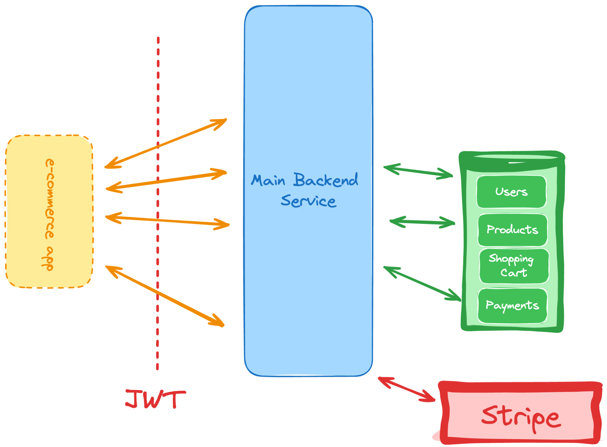

# E-Commerce API

Plataforma de comercio electrónico con carrito de compras e integración de pasarela de pago.

Se requiere construir una API para una plataforma de comercio electrónico. Si has desarrollado los otros proyectos en esta hoja de ruta, tendrás que tener en cuenta todo lo que has aprendido hasta ahora:

*   Autenticación JWT para permitir que muchos usuarios puedan interactuar con ella.
*   Implementación de operaciones CRUD simples.
*   Interacción con servicios externos. Aquí te integrarás con pasarelas de pago como Stripe.
*   Un modelo de datos complejo que pueda manejar productos, carritos de compras y más.

El objetivo de este proyecto es ayudarte a entender cómo construir una aplicación con mucha lógica y modelos de datos complejos. También aprenderás cómo interactuar con servicios externos y manejar la autenticación de usuarios.

## Requisitos

Aquí hay una lista aproximada de requisitos para este proyecto:

*   Capacidad para que los usuarios se registren e inicien sesión.
*   Capacidad para añadir productos a un carrito.
*   Capacidad para eliminar productos de un carrito.
*   Capacidad para ver y buscar productos.
*   Capacidad para que los usuarios finalicen la compra y paguen los productos.

También deberías tener algún tipo de panel de administrador donde solo tú puedas añadir productos, establecer los precios, gestionar el inventario y más.

Comienza construyendo primero la API y luego el frontend; puedes usar herramientas como Postman para interactuar con tu API. Alternativamente, construye un frontend simple con HTML, CSS y algún motor de plantillas como Jinja o EJS.

Este proyecto es una excelente manera de aprender a construir una aplicación compleja con muchas partes móviles. Recomiendo encarecidamente que completes este proyecto antes de pasar a proyectos más avanzados.
