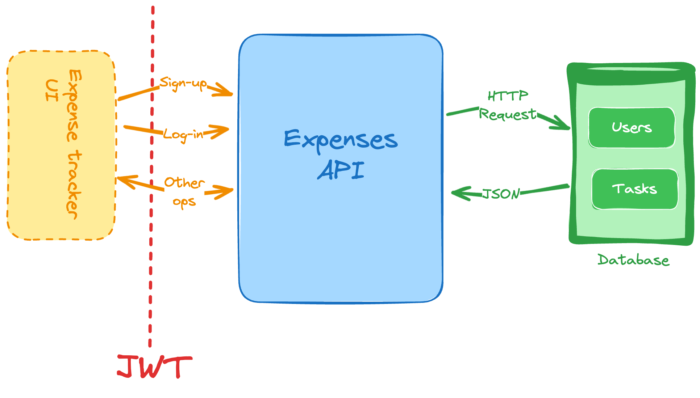

# API de Control de Gastos

Construye una API para una aplicación de control de gastos personales.

Comienza a construir, envía tu solución y recibe comentarios de la comunidad.

Construye una API para una aplicación de control de gastos. Esta API debe permitir a los usuarios crear, leer, actualizar y eliminar gastos. Los usuarios deben poder registrarse e iniciar sesión en la aplicación. Cada usuario debe tener su propio conjunto de gastos.

## Características

Estas son las funcionalidades que debes implementar en tu API de Control de Gastos:

*   **Registro** como nuevo usuario.
*   **Generar y validar JWTs** para manejar la autenticación y la sesión de usuario.
*   **Listar y filtrar** tus gastos pasados. Puedes añadir los siguientes filtros:
    *   Última semana
    *   Último mes
    *   Últimos 3 meses
    *   Personalizado (para especificar una fecha de inicio y fin a tu elección).
*   **Añadir** un nuevo gasto.
*   **Eliminar** gastos existentes.
*   **Actualizar** gastos existentes.

## Restricciones

Puedes usar cualquier lenguaje de programación y framework de tu elección. Puedes usar una base de datos de tu elección para almacenar los datos. Puedes usar cualquier ORM o biblioteca de base de datos para interactuar con ella.

Aquí hay algunas restricciones que debes seguir:

*   Utilizarás **JWT (JSON Web Token)** para proteger los endpoints e identificar al solicitante.
*   Para las diferentes **categorías de gastos**, puedes usar la siguiente lista (siéntete libre de decidir cómo implementar esto como parte de tu modelo de datos):
    *   Comestibles
    *   Ocio
    *   Electrónica
    *   Servicios
    *   Ropa
    *   Salud
    *   Otros

Este es el último proyecto de "principiante" en la ruta de backend. Si has completado todos los proyectos en la ruta de backend, deberías tener un buen entendimiento de cómo construir una aplicación backend. Ahora puedes pasar a los proyectos "intermedios" en la ruta de backend.

¡Absolutamente! Si tienes más textos de proyectos de roadmap.sh o cualquier otro contenido que necesites, no dudes en enviármelos. Estaré encantado de ayudarte a formatearlos.
