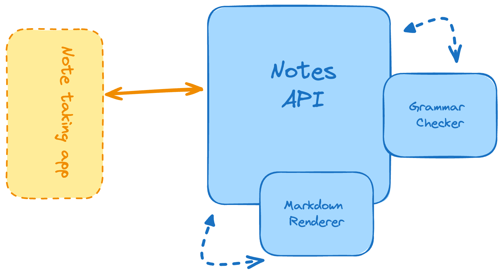

# Markdown Note-taking App

Construye una aplicación para tomar notas que utilice markdown para el formato.

Se requiere construir una aplicación simple para tomar notas que permita a los usuarios subir archivos markdown, revisar la gramática, guardar la nota y renderizarla en HTML. El objetivo de este proyecto es ayudarte a aprender cómo manejar la subida de archivos en una API RESTful, analizar y renderizar archivos markdown usando librerías, y revisar la gramática de las notas.

## Características

Debes implementar las siguientes características:

*   Debes proporcionar un endpoint para revisar la gramática de la nota.
*   Debes proporcionar también un endpoint para guardar la nota, que pueda ser enviada como texto Markdown.
*   Debes proporcionar un endpoint para listar las notas guardadas (es decir, los archivos markdown subidos).
*   Debes devolver la versión HTML de la nota Markdown (nota renderizada) a través de otro endpoint.

## Consejos para Empezar

Siéntete libre de usar cualquier lenguaje de programación y framework de tu elección. Utiliza el gestor de paquetes del lenguaje elegido para instalar las librerías necesarias para analizar y renderizar archivos markdown.
