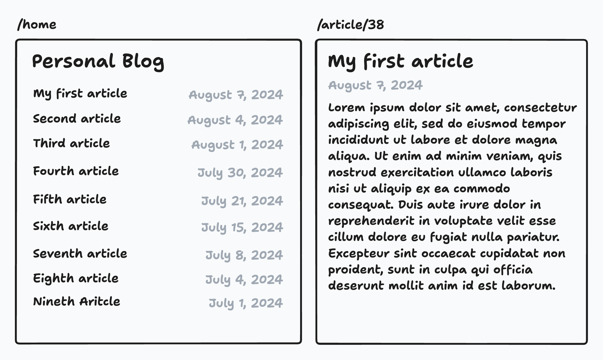
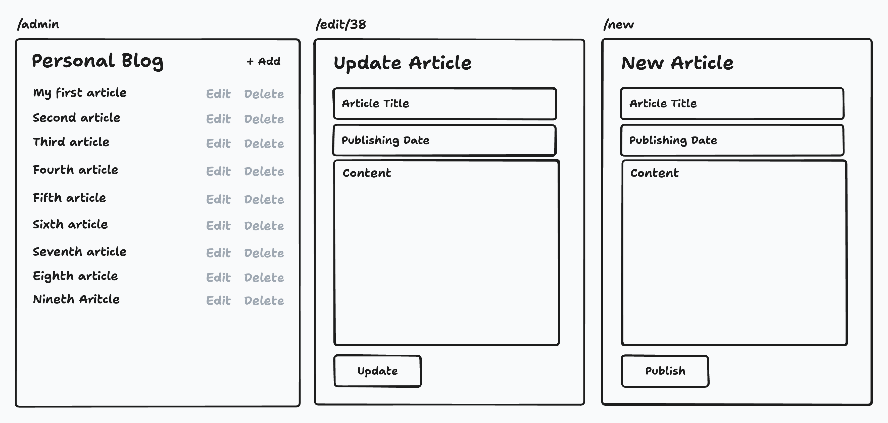

# Blog Personal

Construye un blog personal para escribir y publicar artículos sobre diversos temas.

Comienza a construir, envía tu solución y recibe comentarios de la comunidad.

Se te pide construir un blog personal donde puedas escribir y publicar artículos. El blog tendrá dos secciones: una sección de invitados y una sección de administrador.

### Sección de Invitados — Un conjunto de páginas a las que cualquiera puede acceder:
*   **Página de Inicio:** Esta página mostrará la lista de artículos publicados en el blog.
*   **Página de Artículo:** Esta página mostrará el contenido del artículo junto con la fecha de publicación.

### Sección de Administrador — Son las páginas a las que solo tú puedes acceder para publicar, editar o eliminar artículos:
*   **Panel de Control:** Esta página mostrará la lista de artículos publicados en el blog junto con la opción de añadir un nuevo artículo, editar uno existente o eliminar un artículo.
*   **Página de Añadir Artículo:** Esta página contendrá un formulario para añadir un nuevo artículo. El formulario tendrá campos como título, contenido y fecha de publicación.
*   **Página de Editar Artículo:** Esta página contendrá un formulario para editar un artículo existente. El formulario tendrá campos como título, contenido y fecha de publicación.

Aquí tienes los mockups para darte una idea de las diferentes páginas del blog.

*   **Páginas a las que cualquiera puede acceder**

*   **Páginas a las que solo el administrador puede acceder**

## Cómo Implementarlo

Aquí tienes algunas pautas para ayudarte a implementar el blog personal:

### Almacenamiento
Para mantener las cosas simples por ahora, puedes usar el sistema de archivos para almacenar los artículos. Cada artículo se guardará como un archivo separado en un directorio. El archivo contendrá el título, el contenido y la fecha de publicación del artículo. Puedes usar formato JSON o Markdown para almacenar los artículos.

### Backend
Puedes usar cualquier lenguaje de programación para construir el backend del blog. No es necesario que lo hagas como una API para este proyecto; tenemos otros proyectos para eso. Puedes tener páginas que rendericen el HTML directamente desde el servidor y formularios que envíen datos al servidor.

### Frontend
Para el frontend, puedes usar HTML y CSS (sin necesidad de JavaScript por ahora). Puedes usar cualquier motor de plantillas para renderizar los artículos en el frontend.

### Autenticación
Puedes implementar autenticación básica para la sección de administrador. Puedes usar la autenticación básica HTTP estándar o simplemente hardcodear el nombre de usuario y la contraseña en el código por ahora y crear una página de inicio de sesión simple que cree una sesión para el administrador.

Después de completar este proyecto, habrás practicado el uso de plantillas, operaciones del sistema de archivos, autenticación básica, manejo de formularios y renderizado de páginas HTML desde el servidor. Puedes extender este proyecto añadiendo características como comentarios, categorías, etiquetas, funcionalidad de búsqueda, etc. Asegúrate de revisar los otros proyectos de backend que abordan temas más avanzados como bases de datos, APIs, mejores prácticas de seguridad, etc.
