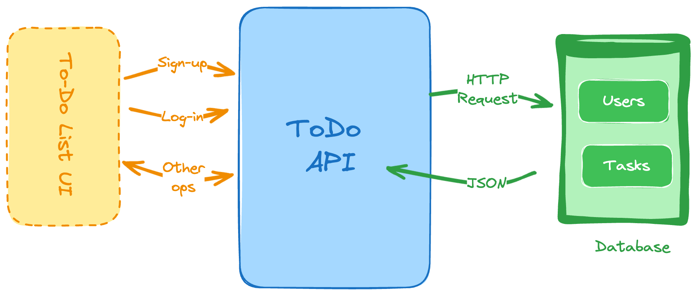

# API de Lista de Tareas (To-Do List)

Construye una API RESTful para permitir a los usuarios gestionar su lista de tareas.

Comienza a construir, envía tu solución y recibe comentarios de la comunidad.

En este proyecto, se te requiere desarrollar una API RESTful para permitir a los usuarios gestionar su lista de tareas. Los proyectos de backend anteriores solo se han centrado en operaciones CRUD, pero este proyecto también te requerirá implementar autenticación de usuarios.



## Objetivos

Las habilidades que aprenderás con este proyecto incluyen:

*   Autenticación de usuarios
*   Diseño de esquemas y bases de datos
*   Diseño de APIs RESTful
*   Operaciones CRUD
*   Manejo de errores
*   Seguridad

## Requisitos

Se te requiere desarrollar una API RESTful con los siguientes endpoints:

*   **Registro de usuario** para crear un nuevo usuario.
*   **Endpoint de inicio de sesión** para autenticar al usuario y generar un token.
*   **Operaciones CRUD** para gestionar la lista de tareas.
*   Implementar **autenticación de usuarios** para permitir solo a usuarios autorizados acceder a la lista de tareas.
*   Implementar **manejo de errores** y **medidas de seguridad**.
*   Usar una **base de datos** para almacenar los datos del usuario y de la lista de tareas (puedes usar cualquier base de datos de tu elección).
*   Implementar **validación de datos** adecuada.
*   Implementar **paginación y filtrado** para la lista de tareas.

A continuación, se muestra una lista de los endpoints y los detalles de la solicitud y respuesta:

### Registro de Usuario

Registra un nuevo usuario usando la siguiente solicitud:

```javascript
POST /register
{
  "name": "Juan Pérez",
  "email": "juan@perez.com",
  "password": "contraseña"
}
```

Esto validará los detalles proporcionados, asegurará que el correo electrónico sea único y almacenará los datos del usuario en la base de datos. Asegúrate de **hashear la contraseña** antes de almacenarla en la base de datos. Responde con un **token** que pueda usarse para la autenticación si el registro es exitoso.

```json
{
  "token": "eyJhbGciOiJIUzI1NiIsInR5cCI6IkpXVCJ9"
}
```

El token puede ser un JWT o una cadena aleatoria que pueda usarse para la autenticación. Dejamos a tu criterio decidir los detalles de implementación.

### Inicio de Sesión de Usuario

Autentica al usuario usando la siguiente solicitud:

```javascript
POST /login
{
  "email": "juan@perez.com",
  "password": "contraseña"
}
```

Esto validará el correo electrónico y la contraseña proporcionados, y responderá con un token si la autenticación es exitosa.

```json
{
  "token": "eyJhbGciOiJIUzI1NiIsInR5cCI6IkpXVCJ9"
}
```

### Crear un Elemento de Tarea (To-Do)

Crea un nuevo elemento de tarea usando la siguiente solicitud:

```javascript
POST /todos
{
  "title": "Comprar comestibles",
  "description": "Comprar leche, huevos y pan"
}
```

El usuario debe enviar el token recibido del endpoint de inicio de sesión en el encabezado para autenticar la solicitud. Puedes usar el encabezado `Authorization` con el token como valor. En caso de que el token falte o no sea válido, responde con un error y el código de estado `401`.

```json
{
  "message": "No autorizado"
}
```

Tras la creación exitosa del elemento de tarea, responde con los detalles del elemento creado.

```json
{
  "id": 1,
  "title": "Comprar comestibles",
  "description": "Comprar leche, huevos y pan"
}
```

### Actualizar un Elemento de Tarea

Actualiza un elemento de tarea existente usando la siguiente solicitud:

```javascript
PUT /todos/1
{
  "title": "Comprar comestibles",
  "description": "Comprar leche, huevos, pan y queso"
}
```

Al igual que en el endpoint de crear tarea, el usuario debe enviar el token recibido. Además, asegúrate de **validar que el usuario tiene permiso** para actualizar el elemento de la tarea, es decir, que el usuario es el creador del elemento que está actualizando. Responde con un error y el código de estado `403` si el usuario no está autorizado para actualizar el elemento.

```json
{
  "message": "Prohibido"
}
```

Tras la actualización exitosa del elemento de tarea, responde con los detalles actualizados del elemento.

```json
{
  "id": 1,
  "title": "Comprar comestibles",
  "description": "Comprar leche, huevos, pan y queso"
}
```

### Eliminar un Elemento de Tarea

Elimina un elemento de tarea existente usando la siguiente solicitud:

```javascript
DELETE /todos/1
```

El usuario debe estar autenticado y autorizado para eliminar el elemento de la tarea. Tras la eliminación exitosa, responde con el código de estado `204` (Sin Contenido).

### Obtener Elementos de Tarea

Obtén la lista de elementos de tarea usando la siguiente solicitud:

```javascript
GET /todos?page=1&limit=10
```

El usuario debe estar autenticado para acceder a las tareas y la respuesta debe estar **paginada**. Responde con la lista de elementos de tarea junto con los detalles de paginación.

```json
{
  "data": [
    {
      "id": 1,
      "title": "Comprar comestibles",
      "description": "Comprar leche, huevos y pan"
    },
    {
      "id": 2,
      "title": "Pagar facturas",
      "description": "Pagar facturas de electricidad y agua"
    }
  ],
  "page": 1,
  "limit": 10,
  "total": 2
}
```

## Bonus (Opcional)

*   Implementar **filtrado y ordenación** para la lista de tareas.
*   Implementar **pruebas unitarias** para la API.
*   Implementar **limitación de tasa (rate limiting)** para la API.
*   Implementar un **mecanismo de tokens de actualización (refresh token)** para la autenticación.

Este proyecto te ayudará a entender cómo diseñar e implementar una API RESTful con autenticación de usuarios. También aprenderás a trabajar con bases de datos, manejar errores e implementar medidas de seguridad.

