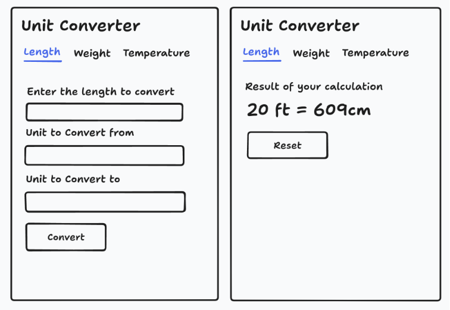

# Conversor de Unidades

Conversor de unidades para convertir entre diferentes unidades de medida.

Comienza a construir, envía tu solución y recibe comentarios de la comunidad.

Se te pide construir una aplicación web simple que pueda convertir entre diferentes unidades de medida. Puede convertir unidades de longitud, peso, volumen, área, temperatura y más. El usuario puede ingresar un valor y seleccionar las unidades de origen y destino. La aplicación mostrará entonces el valor convertido.

## Requisitos

Construye una página web simple que tenga diferentes secciones para las distintas unidades de medida. El usuario podrá ingresar un valor para convertir, seleccionar las unidades de origen y destino, y ver el valor convertido.

- El usuario puede ingresar un valor para convertir.
- El usuario puede seleccionar las unidades de origen y destino.
- El usuario puede ver el valor convertido.
- El usuario puede convertir entre diferentes unidades de medida como longitud, peso, temperatura, etc. (más abajo se detallan).

Puedes incluir las siguientes unidades de medida para convertir entre ellas:

*   **Longitud:** milímetro, centímetro, metro, kilómetro, pulgada, pie, yarda, milla.
*   **Peso:** miligramo, gramo, kilogramo, onza, libra.
*   **Temperatura:** Celsius, Fahrenheit, Kelvin.

## Cómo funciona

No necesitas usar ninguna base de datos para este proyecto. Habrá una página web simple que enviará el formulario al servidor, obtendrá el valor convertido y lo mostrará en la página web.

Puedes tener 3 páginas web para cada tipo de conversión de unidad (longitud, peso, temperatura) con formularios para ingresar el valor y seleccionar las unidades de origen y destino. Al enviar un formulario, se enviarán los datos a la página actual (es decir, `target="_self"`) y se mostrará el valor convertido. Puedes hacer esto usando el lenguaje de programación de backend que elijas, es decir, verificar si el formulario se ha enviado, luego calcular el valor convertido y mostrarlo en la página web; si no se ha enviado, mostrar el formulario.
