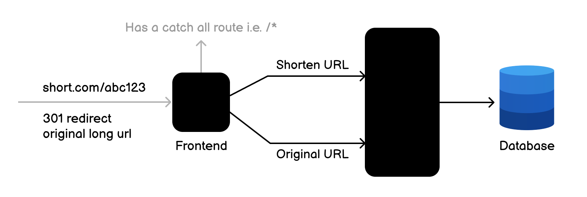

# URL Shortening Service

Construye una API de acortador de URLs que ayude a acortar URLs largas.

Se requiere crear una API RESTful simple que permita a los usuarios acortar URLs largas. La API debe proporcionar endpoints para crear, recuperar, actualizar y eliminar URLs cortas. También debe proporcionar estadísticas sobre el número de veces que se ha accedido a una URL corta.



## Requisitos

Debes crear una API RESTful para un servicio de acortamiento de URLs. La API debe permitir a los usuarios realizar las siguientes operaciones:

*   Crear una nueva URL corta
*   Recuperar una URL original a partir de una URL corta
*   Actualizar una URL corta existente
*   Eliminar una URL corta existente
*   Obtener estadísticas de la URL corta (por ejemplo, número de veces que se ha accedido)

Opcionalmente, puedes configurar un frontend mínimo para interactuar con la API y configurar redireccionamientos de las URLs cortas a las URLs originales.

## Endpoints de la API

A continuación se muestran los detalles para cada operación de la API.

### Crear URL Corta

Crea una nueva URL corta utilizando el método `POST`.

```
POST /shorten
{
  "url": "https://www.example.com/some/long/url"
}
```

El endpoint debe validar el cuerpo de la solicitud y devolver un código de estado `201 Created` con la nueva URL corta creada, es decir:

```json
{
  "id": "1",
  "url": "https://www.example.com/some/long/url",
  "shortCode": "abc123",
  "createdAt": "2021-09-01T12:00:00Z",
  "updatedAt": "2021-09-01T12:00:00Z"
}
```

o un código de estado `400 Bad Request` con mensajes de error en caso de errores de validación. Los códigos cortos deben ser únicos y deben generarse aleatoriamente.

### Recuperar URL Original

Recupera la URL original a partir de una URL corta utilizando el método `GET`.

```
GET /shorten/abc123
```

El endpoint debe devolver un código de estado `200 OK` con la URL original, es decir:

```json
{
  "id": "1",
  "url": "https://www.example.com/some/long/url",
  "shortCode": "abc123",
  "createdAt": "2021-09-01T12:00:00Z",
  "updatedAt": "2021-09-01T12:00:00Z"
}
```

o un código de estado `404 Not Found` si no se encontró la URL corta. Tu frontend debe ser responsable de recuperar la URL original usando la URL corta y redirigir al usuario a la URL original.

### Actualizar URL Corta

Actualiza una URL corta existente utilizando el método `PUT`.

```
PUT /shorten/abc123
{
  "url": "https://www.example.com/some/updated/url"
}
```

El endpoint debe validar el cuerpo de la solicitud y devolver un código de estado `200 OK` con la URL corta actualizada, es decir:

```json
{
  "id": "1",
  "url": "https://www.example.com/some/updated/url",
  "shortCode": "abc123",
  "createdAt": "2021-09-01T12:00:00Z",
  "updatedAt": "2021-09-01T12:30:00Z"
}
```

o un código de estado `400 Bad Request` con mensajes de error en caso de errores de validación. Debe devolver un código de estado `404 Not Found` si no se encontró la URL corta.

### Eliminar URL Corta

Elimina una URL corta existente utilizando el método `DELETE`.

```
DELETE /shorten/abc123
```

El endpoint debe devolver un código de estado `204 No Content` si la URL corta se eliminó correctamente o un código de estado `404 Not Found` si no se encontró la URL corta.

### Obtener Estadísticas de URL

Obtén estadísticas de una URL corta utilizando el método `GET`.

```
GET /shorten/abc123/stats
```

El endpoint debe devolver un código de estado `200 OK` con las estadísticas, es decir:

```json
{
  "id": "1",
  "url": "https://www.example.com/some/long/url",
  "shortCode": "abc123",
  "createdAt": "2021-09-01T12:00:00Z",
  "updatedAt": "2021-09-01T12:00:00Z",
  "accessCount": 10
}
```

o un código de estado `404 Not Found` si no se encontró la URL corta.

**Stack Tecnológico**

Siéntete libre de usar cualquier lenguaje de programación, framework y base de datos de tu elección para este proyecto. Aquí hay algunas sugerencias:

*   Si usas JavaScript, puedes usar Node.js con Express.js
*   Si usas Python, puedes usar Flask o Django
*   Si usas Java, puedes usar Spring Boot
*   Si usas Ruby, puedes usar Ruby on Rails

Para las bases de datos, puedes usar:

*   MySQL si usas SQL
*   MongoDB si usas NoSQL

Tu trabajo es implementar la funcionalidad principal de la API, enfocándote en crear, recuperar, actualizar y eliminar URLs cortas, así como en rastrear y recuperar estadísticas de acceso. No es necesario que implementes autenticación o autorización para este proyecto.
